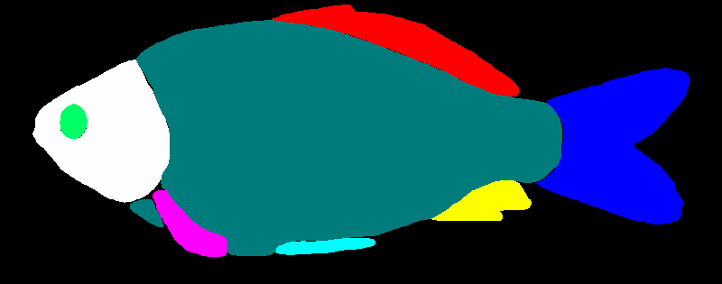
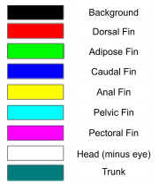
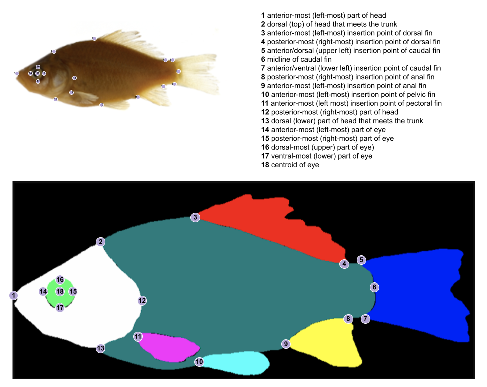
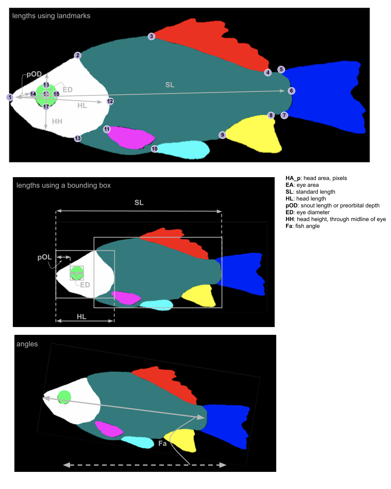

# Morphology-analysis

The primary goal of this repository is to produce a presence table (default), create landmarks (optional), visualize landmarks (optional), and extract measurements (optional) from a segmented fish image (see [BGNN-trait-segmentation](https://github.com/hdr-bgnn/BGNN-trait-segmentation)).

Secondarily, this repository provides a framework for creating modularized tools by using classes.

Finally, this repository also provides a way to visualize outputs of the tools and test functionalities using a jupyter notebook. 

This repository is automatically containerized when a new release is published. This allows for easy integration into the [BGNN_Snakemake](https://github.com/hdr-bgnn/BGNN_Snakemake).

This tool was originally developed for the [Minnows Project](https://github.com/hdr-bgnn/Minnow_Segmented_Traits).

## 1- Input: Segmented Image

The input is the output of the segmentation model, which is a file named basename_segmented.png, where "basename" is the file name for the original image. The segmentation model is based on a Convolutional Neural Network (CNN; more specifically unet). More information can be found In the [BGNN-trait-segmentation repository](https://github.com/hdr-bgnn/BGNN-trait-segmentation), in particular see the [segmentation code there](https://github.com/hdr-bgnn/BGNN-trait-segmentation/blob/main/Segment_mini/scripts/segmentation_main.py).

A segmented image looks like the image below, with traits color-coded and visualized by "blobs".  There are 11 trait classes corresponding to the annotated traits. Here, only 9 are used (alt_fin_ray and caudal_fin_ray are excluded).





When you export this image in python using pillow library (PIL.Image.open(file_name)), the corresponding color coding in RGB is:
* 'background': [0, 0, 0],
* 'dorsal_fin': [254, 0, 0],
* 'adipos_fin': [0, 254, 0],
* 'caudal_fin': [0, 0, 254],
* 'anal_fin': [254, 254, 0],
* 'pelvic_fin': [0, 254, 254],
* 'pectoral_fin': [254, 0, 254],
* 'head': [254, 254, 254],
* 'eye': [0, 254, 102],
* 'caudal_fin_ray': [254, 102, 102],
* 'alt_fin_ray': [254, 102, 204],
* 'trunk': [0, 124, 124]


## 2- Default Tool: Presence

The input of the presence tool, is a segmented image named "basename_segmented.png" (as generated by the [BGNN-trait-segmentation](https://github.com/hdr-bgnn/BGNN-trait-segmentation) code).

The output of the presence tool is a presence table named "basename_presence.json" for each image.

To check for the presence of traits, the tool:

  1. Isolates an individual trait (e.g., isolates the dorsal_fin)
  2. Counts the number of blobs for that trait
  3. Calculates the percentage of the area of the largest blob as a proportion of the area of the total blobs for that trait


## 3- Optional Tools: Landmark, Visualize, Metadata, and Measure

The input for the measure tool is a metadata file named "basename_metadata.json" generated by [Drexel](https://github.com/hdr-bgnn/drexel_metadata/tree/Thibault/gen_metadata_mini).

To create landmarks, visualizations, and extract measurements, the tool:

  1. Isolates an individual trait (e.g., isolates the dorsal_fin)
  2. Removes any small blobs of a trait and fills in gaps between blobs of a trait
  3. Identify and place landmarks
  4. Extract measurements of traits using landmarks (_lm), masks (_m), or a bounding box (_bbox)

The user can specify which method of measurement extraction to use (described more below under *measurements*).

Please create an [issue](https://github.com/hdr-bgnn/Morphology-analysis/issues/new) to suggest an additional landmark or measurement. 


### Landmarks

The landmarks used are shown and described below:




**[Landmarks Table](Traits_description/Minnow_Landmarks_v1.csv)**

  Landmark_Number  |  Definition  |  codeDefinition  
----------|------------------|----------------------------------------------
  1 |  Tip of snout, which is the anterior-most part of head  |  Left-most point of the head mask defined by left boundary of the bbox  
  2 |  Beginning of the scales at the dorsal side, where the head meets the trunk  |  Top-most point of the head mask defined by top boundary of the bbox  
  3 |  Anterior insertion of the dorsal fin  |  Left-most point of the dorsal fin mask defined by left boundary of the bbox  
  4 |  Posterior insertion of dorsal fin  |  Furthest bottom point of the dorsal fin defined by bottom boundary of the bbox  
  5 |  Dorsal insertion of the caudal fin  |  Left-most point of the upper half of the caudal fin mask (split through the midline) using the bbox  
  6 |  End of vertebral column, at the midline of the caudal fin  |  Right-most part of the trunk mask defined by the right boundary of the bbox  
  7 |  Ventral insertion of the caudal fin  |  Left-most point of the lower half of the caudal fin mask (split through the midline) using the bbox  
  8 |  Posterior insertion of the anal fin  |  Top-most point of the anal fin mask defined by top boundary of the bbox  
  9 |  Anterior insertion of the anal fin  |  Left-most point of the anal fin mask defined by left boundary of the bbox  
  10 |  Anterior insertion of the pelvic fin  |  Left-most point of the pelvic fin mask defined by left boundary of the bbox  
  11 |  Anterior insertion of the pectoral fin  |  Left-most point of the pectoral fin mask defined by left boundary of the bbox  
  12 |  Most dorsal point of operculum, which is the posterior-most part of the head  |  Right-most part of the head mask defined by the right boundary of the bbox  
  13 |  Most ventral point of operculum, where the head meets the trunk  |  Furthest bottom point of the head mask defined by bottom boundary of the bbox  
  14 |  Anterior-most (left-most) part of eye  |  Left-most point of the eye mask defined by left boundary of the bbox  
  15 |  Posterior-most (right-most) part of eye  |  Right-most part of the eye mask defined by the right boundary of the bbox  
  16 |  Dorsal-most (upper) part of eye)  |  Top-most point of the eye mask defined by top boundary of the bbox  
  17 |  Ventral-most (lower) part of eye  |  Furthest bottom point of the eye mask defined by bottom boundary of the bbox  
  18 |  Center (centroid) of eye  |  Center of the eye mask  


### Visualize

This tool saves the segmented fish image with landmarks. 

Here is an [example](Test_Data/INHS_FISH_000742_image_lm.png) of a visualization of the landmarks on the segmented image.


### Metadata

This is an input file. The file should be generated by [drexel](https://github.com/hdr-bgnn/drexel_metadata/tree/Thibault/gen_metadata_mini) and named basename_metadata.json.
This file contains information about the rule and scale (pixels per cm) to be used for the **Measure** tool. 

The scale function within this tool outputs if a ruler is found, the scale in pixels, and the unit (cm).

Here is an [example](Test_Data/INHS_FISH_000742.json) of a metadata file.

  
### Measure

The output of the measure tool is a file named basename_measure.json that has measurements (in pixels) for each trait.

The measurements extracted are shown and described below:




**[Measurement Table](Traits_description/Minnow_Measurements_v1.csv)**  

  Type  |  Measurement  |  Abbreviation  |  Definition  
--------------------|----------------|------------|-----------------------------------------------
  distance  |  standard length using landmarks  |  SL_lm  |  length from the tip of the snout to the posterior-most part of trunk that meets the caudal fin (length from #1 to #6)	
  distance  |  standard length using bounding box  |  SL_bbox  |  length from the tip of the snout to the posterior-most part of trunk that meets the caudal fin (distance between the left-right sides of a bounding box around the head+eye and trunk)  
  area      |  eye area using pixels of mask  |  EA_m  |  area of the eye region (area of the eye based on the mask that segments the eye)  
  area      |  head area using pixels of mask  |  HA_m  |  area of the head region (area of the head based on the mask that segments the head, including the eye)  
  distance  |  head length using landmarks  |  HL_lm  |  length from the anterior-most part of the head to the posterior-most part of the head (length from #1 to #12)  
  distance  |  head length using bounding box  |  HL_bbox  |  length from the anterior-most part of the head to the posterior-most part of the head (distance between the left-right sides of a bounding box around the head+eye)  
  distance  |  preorbital depth using landmarks  |  pOD_lm  |  length from the anterior-most part of the eye to the anterior-most part of the head (length from #1 to #14)  
  distance  |  preorbital depth using bounding box  |  pOD_bbox  |  length from the anterior-most part of the eye to the anterior-most part of the head (distance between the left edge of the head bounding box and the eye bounding box)  
  distance  |  head depth through midline of the eye  |  HH_lm  |  length from the dorsal-most (top) part of the head to the ventral-most (bottom) part of the head through the midline of the eye (length from the dorsal-most (top) part of the head to the ventral-most (bottom) part of the head through landmark #18)  
  distance  |  eye diameter using landmarks  |  ED_lm  |  length across the eye along the anterior-posterior (left-right) axis (length from #14 to #15)  
  distance  |  eye diameter using landmarks  |  ED_bbox  |  length across the eye along the anterior-posterior (left-right) axis (distance between the left-right sides of a bounding box around the eye)  
  angle  |  fish angle using landmarks  |  Fa_lm  |  angle of the tilt of the fish from horizontal (angle between the SL_lm and and the horizontal line of the image)  
  angle  |  fish angle using PCA  |  Fa_pca  |  angle of the tilt of the fish from horizontal (angle between the pca through the midline of the fish mask and the horizontal line of the image)  

  
#### Method of Measurement Extraction

Each method of measurement extracted is a separate class, which adds more flexibility. These are described in [Trait_class](Scripts/Traits_class.py)

Since the functions are modular, the method for extracting measurements can be specified:


_landmarks_


These measurement trait classes functions have the suffix *"_lm"* to denote the method of extraction. 
The lengths (in pixels) are calculated as the distance between two landmarks (described in the "Definition" column of the trait description csv).


_bounding box (bbox)_


These trait classes functions have the suffix *"_bbox"* to denote the method of extraction.
The lengths (in pixels) are calculated as the distance of a perpendicular line between the edges (either vertical or horizontal) of the bounding box (bbox).


#### Areas


Areas are calculated as the total pixels in the mask of a trait (e.g., head area is the area of the mask of the head). These are described in the "Definition" column of the [Minnow_Measurements_v1.csv](https://github.com/hdr-bgnn/Morphology-analysis/blob/main/Traits_description/Minnow_Measurements_v1.csv).

_mask_


These trait classes have the suffix *"_m"* to denote the method of extraction.


## 4- Usage

By default Morphology_main.py outputs a presence table. Creating landmarks, visualizing landmarks, and measurement tables are optional outputs. 

The inputs for the tools are:

* segmented image: filename_segmented.png (**required**)
* Metadata: basename_metadata.json (*optional*)

The outputs for the tools are:

* Presence: basename_presence.json (**required**)
* Landmark: basename_landmark.json (*optional*)
* Visualize: basename_lm_image.png (*optional*)
* Measure: basename_morphology.json (*optional*)


The main arguments to run this repository are:
```
Morphology_main.py input_image output_presence 
```

To add optional tools, simply add one or all of the following, where "--" denotes the tool and the second term is the output file:

```
Morphology_main.py [-h] [--metadata METADATA] [--morphology MORPHOLOGY] [--landmark LANDMARK] [--lm_image LM_IMAGE] input_image output_presence
```

Where below are the specific tools:

*landmark*
```
--landmark LANDMARK.json
```

*visualize*
```
--visualize VISUALIZE.png
```

*measure*
```
--measure  MEASURE.json
```


Here is an example using [Test_Data](https://github.com/hdr-bgnn/Morphology-analysis/Test_Data): 
```
cd Morphology-analysis/
./Script/Morphology_main.py --metadata Test_Data/INHS_FISH_000742.json --morphology Test_Data/INHS_FISH_000742_measure.json --landmark Test_Data/INHS_FISH_000742_landmark.json --lm_image Test_Data/INHS_FISH_000742_image_lm.png Test_Data/INHS_FISH_000742_segmented.png Test_Data/INHS_FISH_000742_presence.json
```


If no arguments are given, an error message will say "missing two positional arguments", which are the input file and the output file. Use "-h" to pull up the help file with the full list of arguments. 


## 5- Containerization & Versioning

Upon publishing a new release, a Docker container image is automatically built from the release and published on the GitHub container and package registry. The published image is tagged with major, major.minor, and major.minor.patch versions corresponding to the release.

The workflow to build the container is defined as a GitHub action [here](.github/workflows/Deploy_Morpholgy.yml).   

The Dockerfile definition is [here](Dockerfile).

Pull the latest image (in an HPC environment, docker is typically not supported but singularity is): 
```
docker pull ghcr.io/hdr-bgnn/morphology-analysis/morphology:latest 
#singularity pull docker://ghcr.io/hdr-bgnn/morphology-analysis/morphology:latest
```

Run the container (assuming an HPC environment that supports singularity but not docker): 
```
singularity exec morphology_latest.sif Morphology_main.py  <input_file> <presence.json> --metadata <metadata.json> --morphology <Morphology.json> --landmark <landmark.json> --lm_image <image_lm.png>

# Example
singularity exec morphology_latest.sif Morphology_main.py --metadata Test_Data/INHS_FISH_000742.json --morphology Test_Data/INHS_FISH_000742_measure.json --landmark Test_Data/INHS_FISH_000742_landmark.json --lm_image Test_Data/INHS_FISH_000742_image_lm.png Test_Data/INHS_FISH_000742_segmented.png Test_Data/INHS_FISH_000742_presence.json
```
  
## 6- Visualize Morphological Traits 
A [jupyter notebook](Scripts/Morphology_dev.ipynb) is provided that will allow generation and visualization of morphological traits for some sample data. 

### Requirements
To run this notebook requires installing [Jupyter](https://jupyter.org/install) and the requirements defined in [Scripts/morphology_env.yml](Scripts/morphology_env.yml). One method to install the requirments is using the [conda](https://docs.conda.io/en/latest/) command line tool. If the conda command line tool is not already installed one popular python distribution that provides conda is [miniconda](https://docs.conda.io/en/latest/miniconda.html).

Ensure this repository has been cloned and you are in the base directory.

### Local Usage
When running locally both jupyter and the [Scripts/morphology_env.yml](Scripts/morphology_env.yml) requirements can be installed into a single environment for simplicity.
To create an environment named `morphology` with these requirements run the following commands: 
```
conda env create -f Scripts/morphology_env.yml
conda activate morphology
pip install jupyter-lab
```
Then to start jupyter run the following command: 
```
jupyter-lab
```
*If you see a jupyter-lab command not found error you may need to first run `conda activate morphology`.*

Once your web browser opens jupyter navigate to Scripts directory and doubleclick Morphology_dev.ipynb. If prompted select the default python environment.

### Cluster Usage
To run this notebook on a cluster requires creating a conda environment from [Scripts/morphology_env.yml](Scripts/morphology_env.yml) and setting up a  jupyter [kernel](https://docs.jupyter.org/en/latest/projects/kernels.html#kernels). Clusters typically provide their own version of jupyter so that software will not need to be installed, but a kernel must be setup so the cluster provided jupyter software can find your conda environment.

If your cluster provides conda via a minconda3 module the following commands will create an environment named `morphology` with the required dependencies:
```
module load miniconda3
conda env create -f Scripts/morphology_env.yml
```

Next you will need to configure the cluster-provided jupyter software to use the `morphology` conda environment by setting up a kernel.
Consult your cluster specific documentation for instructions setup the kernel. For more about setting up kernels see [ipython documentation](https://ipython.readthedocs.io/en/stable/install/kernel_install.html#kernels-for-different-environments).

Then launch juypter, navigate to Scripts directory, and double-click Morphology_dev.ipynb. If prompted select the kernel associated with the `morphology` conda environment.
